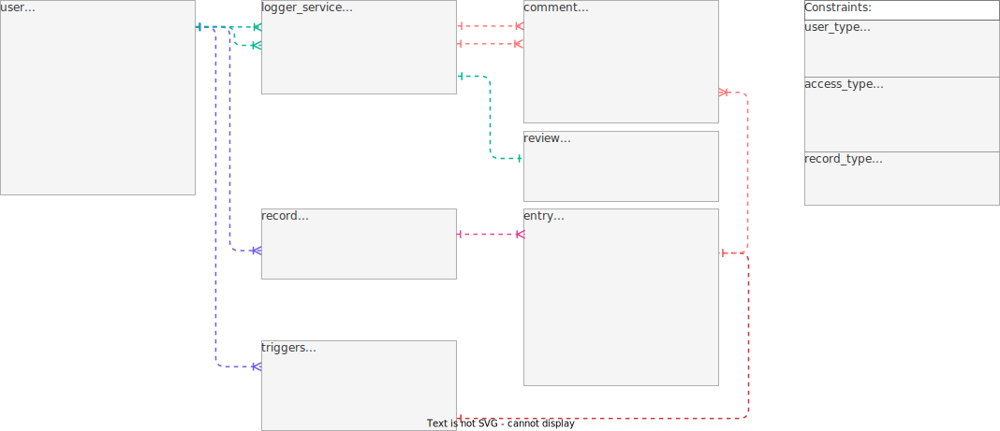
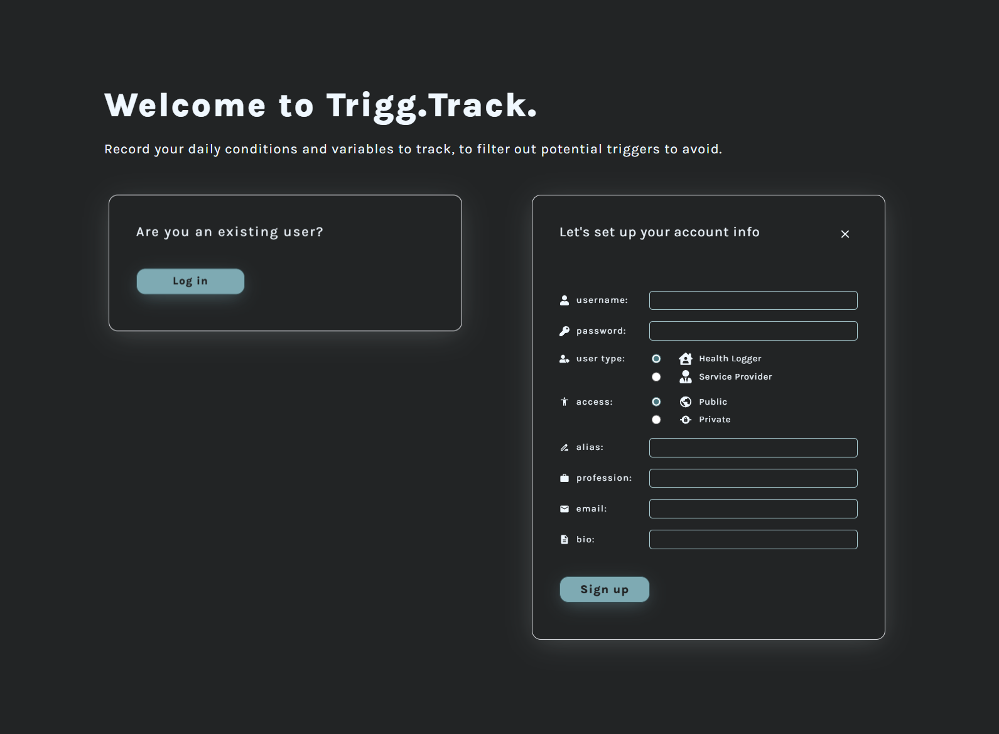

# Trigg.Track. v2

Reiterated version of [trigg.track.](https://github.com/mervin-njy/trigg-track), with the following key differences mostly in technologies used:

|    **Trigg.Track.** | **v1**                | **v2**               |
| ------------------: | --------------------- | -------------------- |
|               Model | NoSQL - Firestore     | SQL - PostgreSQL     |
|          Controller | -                     | Express with Node.js |
|                View | React with JavaScript | "                    |
|             Styling | Vanilla CSS           | Tailwind CSS         |
|       HTTP requests | Read                  | CRUD                 |
| User Authentication | -                     | yes                  |

There is more emphasis on designing on the SQL database, which can be found [here](### Database tables & relationships). There is a need for a logger-service table to link data between connected users, although the project hasn't included that functionality as of now.

THe project also incoporates user authentication as well, through protected routes with the controller. The passwords are hashed with bcrypt, and access/refresh tokens are generated with Json Web Tokens (JWTs). However, the actual JWT log out is not implmented as of now.

## Users

Apart from admin users, there are two main types of users.

| **User type** |                                                               **Health loggers (HL)**                                                                |                                                           **Service Providers (SP)**                                                           |     |
| ------------- | :--------------------------------------------------------------------------------------------------------------------------------------------------: | :--------------------------------------------------------------------------------------------------------------------------------------------: | --- |
| Purpose       | To log daily data regarding health condition and variables. By tracking potential triggers, one can seek external help to plan for lifestyle change. | To promote services, browse and connect with potential customers. Track conditions of existing customers, provide consultations and solutions. |     |
| Profile       |                                                                     1. username                                                                      |                                                                       "                                                                        |     |
|               |                                                                     2. password                                                                      |                                                                       "                                                                        |     |
|               |                                                                     3. user type                                                                     |                                                                       "                                                                        |     |
|               |                                                       4. access - private / public / protected                                                       |                                                              " public / protected                                                              |     |
|               |                                                                   5. display name                                                                    |                                                                       "                                                                        |     |
|               |                                                                    6. profession                                                                     |                                                                       "                                                                        |     |
|               |                                                                  7. contact details                                                                  |                                                                       "                                                                        |     |
|               |                                                   8. bio - description of condition and lifestyle                                                    |                                                   " description of role and motivation etc.                                                    |     |
|               |                                                            9. profile picture (nullable)                                                             |                                                                  " (required)                                                                  |     |
|               |                                               10. records - viewable if public, restricted if private                                                |                                                                  10. reviews                                                                   |     |
| Functions     |                                                      - To create / update / delete user profile                                                      |                                                                       "                                                                        |     |
|               |                                        1. To log daily data regarding health condition and variables to track                                        |                                                                       -                                                                        |     |
|               |                                                   2. To add new options for condition and variable                                                   |                                                                       -                                                                        |     |
|               |                                                     3. To update / edit inputs on specific days                                                      |                                                                       -                                                                        |     |
|               |                                              4. To view history of recorded data in various assortment                                               |                                                                       "                                                                        |     |
|               |                                                5. To add potential triggers to separate trigger list                                                 |                                                                       "                                                                        |     |
|               |                                                   6. To browse, request and access SPs for support                                                   |                                                                       "                                                                        |     |
|               |                                                           7. To access solutions from SPs                                                            |                                                                       "                                                                        |     |
|               |                                                     8. To access comments from SPs on variables                                                      |                                                                       "                                                                        |     |
|               |                                                              9. To communicate with SPs                                                              |                                                                       "                                                                        |     |
|               |                                                          10. To add review comments for SPs                                                          |                                                                       "                                                                        |     |
|               |                                                11. To communicate with other HLs in another platform                                                 |                                                                       -                                                                        |     |

## Diagrams

#### Database tables & relationships

#### Snapshots

## Installation / Dependencies

#### Client:

1. npm i react-router-dom
2. npm install -D tailwindcss postcss autoprefixer
3. npx tailwindcss init -p
4. npm install react-icons --save
5. npm install --save react-toastify

#### Server:

1. npm init -y
2. npm i express nodemon
3. npm i express-validator
4. npm i pg cors dotenv
5. npm i jsonwebtoken uuid bcrypt

_.env config:_

1. PORT
2. ACCESS_SECRET
3. REFRESH_SECRET
4. PGUSER
5. PGPASSWORD
6. PGHOST
7. PGPORT
8. PGDATABASE

## Challenges & unsolved problems

**1. Database design**

Much time has been spent reiterating the SQL tables & relationships. As this was the first time doing, I felt like I was going around in circles. Probably took on more than I could chew too. Nevertheless, it was fun linking tables together.

**2. User Authentication**

I initially struggled understanding the concept of JWT and implementation of user authentication. It took me a while to figure out the process from generating the JWT with payload information on login, to obtaining the access tokens from the request body, to decoding of JWT in the middleware and retrieving the decoded payload in the controller at the request endpoint.

**3. Time management**

In the 10 days timeframe of this project, too much emphasis was given on the database & server. It took slightly over a week, with slightly more than 3 days to work on the frontend development. As a result, not much of the backend work could be implemented. On a personal note, I need to replan my approach to beter manage expectations and workload before starting on projects. Another hurdle on a similar note is a personal problem with balancing functionality and aesthetics when it comes to frontend dev. This slows down the progress towards reaching the MVP stage.

#### To complete:

**1. Server**

Most of the endpoints that were planned for is generally not completed and not tested, let alone implemented in the frontend. I am excited to work on the Logger-servicer interactions.

**2. Client**

One of the benefits with working with tailwind is that I can reuse most CSS templates for different pages much easier than using vanilla CSS. Since I have more or less decided on the design of the UI components, I can focus on the functionalities for the rest of the frontend components. As of now, I have yet to incorporate the records page, connect and services page, profile page for different users, and reviews and comments functionalities of the servicers.
